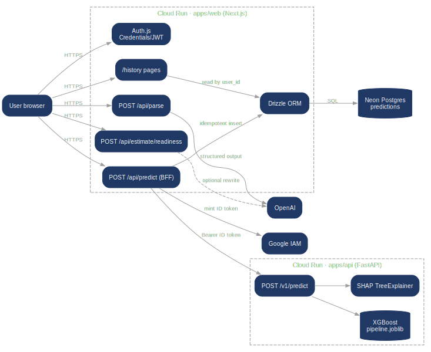
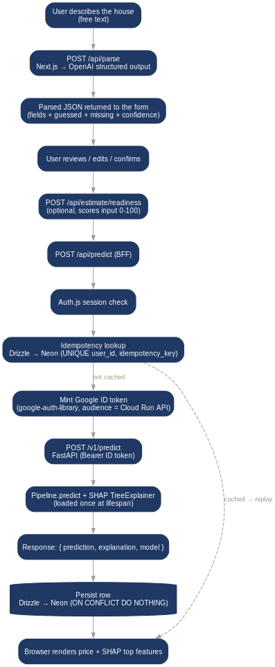
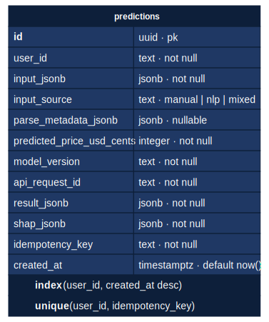

# Architecture

How the runtime fits together, where the data flows, and what each
component owns.

The browser only talks to Next.js. Next.js mints Google ID tokens to
reach the FastAPI service on Cloud Run, and writes confirmed
predictions to Neon. FastAPI stays stateless — it loads the artifact
once at startup and never touches user data.

## Ownership boundaries

| Concern | Owner | Why it lives there |
|---|---|---|
| HTML / CSS / JS served to the browser | `apps/web` | Next.js runtime |
| LLM call for natural-language parsing | `apps/web` route handler | The OpenAI key never reaches the browser, and putting the call in Python would add a second network hop plus a second secret to manage |
| Structured-input validation | `zod` on the web, Pydantic on the API | Defense in depth — both schemas come from the Python `Schema` |
| Running the sklearn pipeline | `apps/api` | Single place where the serialized artifact is loaded |
| SHAP attribution | `apps/api` | Same image, same memory — keeps predict + explain in one round trip |
| Auth session | `apps/web` via Auth.js JWT | No DB adapter, no auth tables — sessions live in signed cookies |
| Prediction history | `apps/web` via Drizzle → Neon | Only confirmed predictions land in Postgres; the API stays stateless about users |
| Training | `ml/` | Offline; produces the artifact, does not get deployed |
| Experiment metadata | MLflow (local file backend) | Lives under `mlruns/`, gitignored |
| Data and model artifacts | Git | 2 MB total — see [ADR-0004](./adr/0004-small-artifacts-in-git.md) |

## Predict flow end-to-end

The full happy path for a single estimate, from the user typing a
description to the saved prediction:

A few details worth calling out:

- **Idempotency** is enforced at the database with
  `UNIQUE(user_id, idempotency_key)` and `ON CONFLICT DO NOTHING`. A
  retry from the browser returns the original row instead of burning a
  new model call.
- **Service-to-service auth** is Google-issued ID tokens. The web
  service mints them on demand with `google-auth-library`, scoped to
  the API's Cloud Run audience. The API trusts Google's signature.
- **The model is baked into the API image**
  ([`apps/api/Dockerfile.gcp`](../apps/api/Dockerfile.gcp)). Cloud Run
  cold starts land on a ready instance — no DVC pull, no remote
  fetch, no mount.
- **SHAP runs on the same request** with the `TreeExplainer`
  pre-fitted in the FastAPI lifespan. Sub-100 ms per prediction in
  steady state.

## Prediction history schema

A single Postgres table is all the persistence needed for v1. Drizzle
ORM, migration applied against Neon.

Auth lives entirely in Auth.js JWT cookies, so there is no `users`
table — `user_id` is the email of the demo user from the configured
credentials. Adding real OAuth later would mean introducing the
standard Auth.js adapter tables, not changing this schema.

## Cross-cutting rules

- **Clean Architecture inside the API.** `api → services → domain`,
  with `infra` behind protocols. The domain never imports FastAPI or
  scikit-learn — only interfaces.
- **One schema, one source of truth.** Pydantic models in `hou53_ml`
  define the input shape. FastAPI derives its OpenAPI from them. The
  web's zod schema and the NLP parser's structured-output schema are
  generated from the same Python file. Any drift breaks `pnpm build`.
- **Reproducibility from a commit.** Pinning Python (`uv.lock`), Node
  (`pnpm-lock.yaml`), the source CSV (`data/raw/`), and the artifact
  (`models/`) means any commit on `main` rebuilds bit-identically.
- **Structured logs and request IDs from day one.** Every API request
  gets a `x-request-id` header that propagates through the BFF and
  shows up in every structlog line. Cloud Logging picks them up
  automatically.

## What is intentionally not here yet

- **Confidence intervals.** The API returns a point estimate plus
  SHAP. Adding a CI requires either bootstrapping XGBoost predictions
  or training a quantile regressor side-car. Both have ADR-worthy
  trade-offs; neither lands without that decision.
- **Model registry.** One artifact per deploy. If this grew into a
  product, the next step is MLflow's remote tracking + model registry
  for staging/production stages.
- **Drift monitoring.** Evidently AI is the natural fit. Pointless
  without a continuous data feed.
